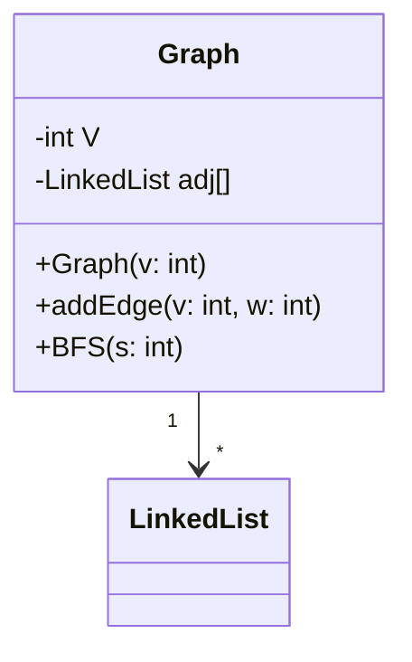

# SEARCHING  ALGORITHMS

|Algo                          |Here                        |
|-------------------------------|-----------------------------|
|`' Linear Search'`            |[->](https://github.com/aadarsh-nagrath/Data-Structures-Algorithms/new/main#breadth-first-search-bfs)            |
|`"Binary Search"`            |[->](https://github.com/aadarsh-nagrath/Data-Structures-Algorithms/new/main#binary-search)            |
|`DFS`|[DFS](https://github.com/aadarsh-nagrath/Data-Structures-Algorithms/new/main#depth-first-search-dfs)|
|`BFS`|[BFS](https://github.com/aadarsh-nagrath/Data-Structures-Algorithms/new/main#breadth-first-search-bfs)|

### Linear Search

**Explanation:**
Linear Search is a simple searching algorithm that iterates over each element in a list to find the target value. It starts from the beginning and compares each element with the target until a match is found or the list ends.

**Example:**
```java
public class LinearSearch {
    public static int linearSearch(int[] arr, int target) {
        for (int i = 0; i < arr.length; i++) {
            if (arr[i] == target) {
                return i;
            }
        }
        return -1;
    }

    public static void main(String[] args) {
        int[] arr = {4, 2, 7, 1, 9, 5};
        int target = 7;
        System.out.println("Index of " + target + ": " + linearSearch(arr, target)); // Output: Index of 7 : 2
    }
}
```

**DSA Question:**
Given an array of integers `arr` and a target integer `target`, implement the Linear Search algorithm in Java to find the index of the target in the array. If the target is not found, return -1.

**Answer and Explanation:**
```java
public class LinearSearch {
    public static int linearSearch(int[] arr, int target) {
        for (int i = 0; i < arr.length; i++) {
            if (arr[i] == target) {
                return i;
            }
        }
        return -1;
    }

    public static void main(String[] args) {
        int[] arr = {4, 2, 7, 1, 9, 5};
        int target = 7;
        System.out.println("Index of " + target + ": " + linearSearch(arr, target)); // Output: Index of 7 : 2
    }
}
```
Explanation: In the `linearSearch` method, we iterate through each element of the array `arr` using a for loop. If the current element matches the target, we return its index. If the loop finishes without finding the target, we return -1.

This algorithm has a time complexity of O(n), where n is the number of elements in the array.

### Binary Search

**Explanation:**
Binary Search is a fast searching algorithm that works on sorted arrays. It compares the target value to the middle element of the array. If they are not equal, the half in which the target cannot lie is eliminated and the search continues on the remaining half until the target is found or the subarray becomes empty.

**Example:**
```java
public class BinarySearch {
    public static int binarySearch(int[] arr, int target) {
        int left = 0;
        int right = arr.length - 1;
        
        while (left <= right) {
            int mid = left + (right - left) / 2;
            
            if (arr[mid] == target) {
                return mid;
            } else if (arr[mid] < target) {
                left = mid + 1;
            } else {
                right = mid - 1;
            }
        }
        
        return -1;
    }

    public static void main(String[] args) {
        int[] arr = {1, 2, 4, 5, 7, 9};
        int target = 5;
        System.out.println("Index of " + target + ": " + binarySearch(arr, target)); // Output: Index of 5 : 3
    }
}
```

**DSA Question:**
Given a sorted array of integers `arr` and a target integer `target`, implement the Binary Search algorithm in Java to find the index of the target in the array. If the target is not found, return -1.

**Answer and Explanation:**
```java
public class BinarySearch {
    public static int binarySearch(int[] arr, int target) {
        int left = 0;
        int right = arr.length - 1;
        
        while (left <= right) {
            int mid = left + (right - left) / 2;
            
            if (arr[mid] == target) {
                return mid;
            } else if (arr[mid] < target) {
                left = mid + 1;
            } else {
                right = mid - 1;
            }
        }
        
        return -1;
    }

    public static void main(String[] args) {
        int[] arr = {1, 2, 4, 5, 7, 9};
        int target = 5;
        System.out.println("Index of " + target + ": " + binarySearch(arr, target)); // Output: Index of 5 : 3
    }
}
```
Explanation: In the `binarySearch` method, we initialize two pointers, `left` and `right`, representing the indices of the subarray in which we want to search. We then enter a while loop where we calculate the middle index (`mid`) of the subarray and compare the value at `arr[mid]` with the target value. If they are equal, we return `mid`. If the target is greater than `arr[mid]`, we update `left` to `mid + 1` to search in the right half of the subarray. If the target is smaller, we update `right` to `mid - 1` to search in the left half of the subarray. We continue this process until `left` is greater than `right`, indicating that the target is not present in the array.

This algorithm has a time complexity of O(log n), where n is the number of elements in the array.

### Depth First Search (DFS)

**Explanation:**
Depth First Search is a graph traversal algorithm that explores as far as possible along each branch before backtracking. It starts at a selected node and explores as far as possible along each branch before backtracking. 

**Example:**
Here's a simple example of how DFS works in a graph:

```java
import java.util.*;

class Graph {
    private int V;
    private LinkedList<Integer> adj[];

    Graph(int v) {
        V = v;
        adj = new LinkedList[v];
        for (int i=0; i<v; ++i)
            adj[i] = new LinkedList();
    }

    void addEdge(int v, int w) {
        adj[v].add(w);
    }

    void DFSUtil(int v, boolean visited[]) {
        visited[v] = true;
        System.out.print(v + " ");
        Iterator<Integer> i = adj[v].listIterator();
        while (i.hasNext()) {
            int n = i.next();
            if (!visited[n])
                DFSUtil(n, visited);
        }
    }

    void DFS(int v) {
        boolean visited[] = new boolean[V];
        DFSUtil(v, visited);
    }

    public static void main(String args[]) {
        Graph g = new Graph(4);
        g.addEdge(0, 1);
        g.addEdge(0, 2);
        g.addEdge(1, 2);
        g.addEdge(2, 0);
        g.addEdge(2, 3);
        g.addEdge(3, 3);
        System.out.println("DFS traversal starting from vertex 2:");
        g.DFS(2);
    }
}
```

**DSA Question:**
Given a graph represented as an adjacency list and a starting vertex, implement the Depth First Search (DFS) algorithm in Java to traverse the graph starting from the given vertex.

**Answer and Explanation:**
```java
import java.util.*;

class Graph {
    private int V;
    private LinkedList<Integer> adj[];

    Graph(int v) {
        V = v;
        adj = new LinkedList[v];
        for (int i=0; i<v; ++i)
            adj[i] = new LinkedList();
    }

    void addEdge(int v, int w) {
        adj[v].add(w);
    }

    void DFSUtil(int v, boolean visited[]) {
        visited[v] = true;
        System.out.print(v + " ");
        Iterator<Integer> i = adj[v].listIterator();
        while (i.hasNext()) {
            int n = i.next();
            if (!visited[n])
                DFSUtil(n, visited);
        }
    }

    void DFS(int v) {
        boolean visited[] = new boolean[V];
        DFSUtil(v, visited);
    }

    public static void main(String args[]) {
        Graph g = new Graph(4);
        g.addEdge(0, 1);
        g.addEdge(0, 2);
        g.addEdge(1, 2);
        g.addEdge(2, 0);
        g.addEdge(2, 3);
        g.addEdge(3, 3);
        System.out.println("DFS traversal starting from vertex 2:");
        g.DFS(2);
    }
}
```
Explanation: In the `DFS` method, we initialize a boolean array `visited` to keep track of visited vertices and call the `DFSUtil` method with the starting vertex and the `visited` array. In the `DFSUtil` method, we mark the current vertex as visited, print it, and recursively call `DFSUtil` for all adjacent vertices that are not yet visited. This process ensures that all vertices reachable from the starting vertex are visited in a depth-first manner.

This algorithm has a time complexity of O(V + E), where V is the number of vertices and E is the number of edges in the graph.

### Breadth First Search (BFS)

**Explanation:**
Breadth First Search is a graph traversal algorithm that explores all the neighboring nodes at the present depth before moving on to the nodes at the next depth level. It starts at a selected node and explores all of its neighbors at the present depth before moving on to the nodes at the next depth level.

**Example:**
Here's a simple example of how BFS works in a graph:

```java
import java.util.*;

class Graph {
    private int V;
    private LinkedList<Integer> adj[];

    Graph(int v) {
        V = v;
        adj = new LinkedList[v];
        for (int i=0; i<v; ++i)
            adj[i] = new LinkedList();
    }

    void addEdge(int v, int w) {
        adj[v].add(w);
    }

    void BFS(int s) {
        boolean visited[] = new boolean[V];
        LinkedList<Integer> queue = new LinkedList<Integer>();
        visited[s] = true;
        queue.add(s);
        while (queue.size() != 0) {
            s = queue.poll();
            System.out.print(s + " ");
            Iterator<Integer> i = adj[s].listIterator();
            while (i.hasNext()) {
                int n = i.next();
                if (!visited[n]) {
                    visited[n] = true;
                    queue.add(n);
                }
            }
        }
    }

    public static void main(String args[]) {
        Graph g = new Graph(4);
        g.addEdge(0, 1);
        g.addEdge(0, 2);
        g.addEdge(1, 2);
        g.addEdge(2, 0);
        g.addEdge(2, 3);
        g.addEdge(3, 3);
        System.out.println("BFS traversal starting from vertex 2:");
        g.BFS(2);
    }
}
```

**DSA Question:**
Given a graph represented as an adjacency list and a starting vertex, implement the Breadth First Search (BFS) algorithm in Java to traverse the graph starting from the given vertex.

**Answer and Explanation:**
```java
import java.util.*;

class Graph {
    private int V;
    private LinkedList<Integer> adj[];

    Graph(int v) {
        V = v;
        adj = new LinkedList[v];
        for (int i=0; i<v; ++i)
            adj[i] = new LinkedList();
    }

    void addEdge(int v, int w) {
        adj[v].add(w);
    }

    void BFS(int s) {
        boolean visited[] = new boolean[V];
        LinkedList<Integer> queue = new LinkedList<Integer>();
        visited[s] = true;
        queue.add(s);
        while (queue.size() != 0) {
            s = queue.poll();
            System.out.print(s + " ");
            Iterator<Integer> i = adj[s].listIterator();
            while (i.hasNext()) {
                int n = i.next();
                if (!visited[n]) {
                    visited[n] = true;
                    queue.add(n);
                }
            }
        }
    }

    public static void main(String args[]) {
        Graph g = new Graph(4);
        g.addEdge(0, 1);
        g.addEdge(0, 2);
        g.addEdge(1, 2);
        g.addEdge(2, 0);
        g.addEdge(2, 3);
        g.addEdge(3, 3);
        System.out.println("BFS traversal starting from vertex 2:");
        g.BFS(2);
    }
}
```

**UML Diagram:**


Explanation: In the `BFS` method, we initialize a boolean array `visited` to keep track of visited vertices and a queue to store vertices to be processed. We mark the starting vertex as visited and enqueue it. Then, we enter a while loop where we dequeue a vertex from the queue, print it, and enqueue all its unvisited neighbors. This process continues until the queue becomes empty.

This algorithm has a time complexity of O(V + E), where V is the number of vertices and E is the number of edges in the graph.
